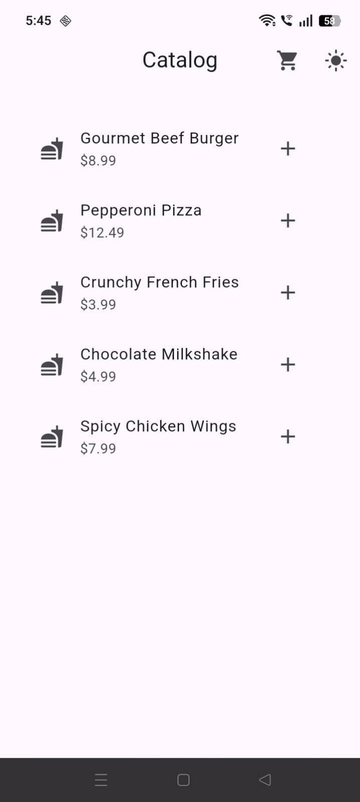
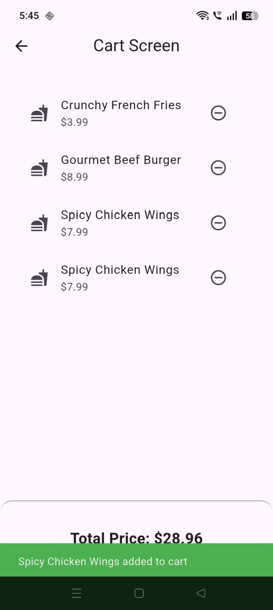
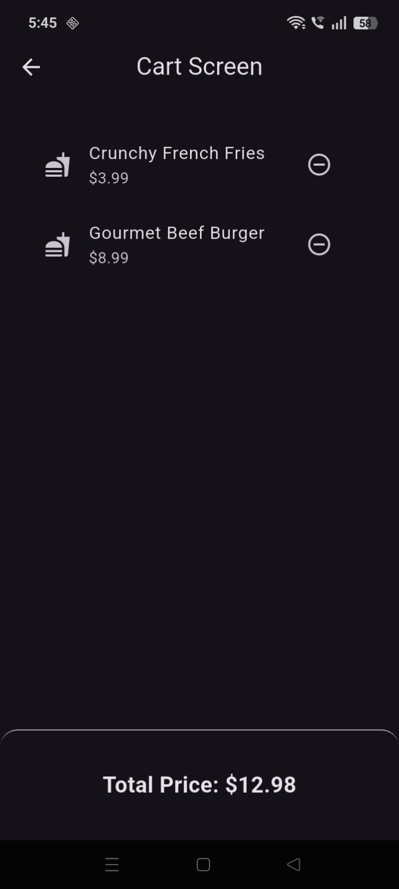

# Flutter Provider State Management 🛒

A production-style Flutter application demonstrating clean and scalable state management using the **Provider** package. This project showcases reactive UI updates, efficient widget rebuilds, app-wide theme switching, and a maintainable architecture using the Provider package.

---

## 📱 App Gallery

| Catalog (Light Mode) | Catalog (Dark Mode) |
| :---: | :---: |
|  |  |

| Cart (Light Mode) | Cart (Dark Mode) |
| :---: | :---: |
|  |  |

---

## ✨ Features

- 🛍️ Browse a catalog of products.
- ➕ Add and remove items from the shopping cart.
- 💰 Automatic total price calculation.
- 🌙 Dynamic Light & Dark Mode switching.
- ⚡ Instant UI updates powered by Provider.
- ♻️ Clean separation of UI and business logic.
- 🚀 Optimized widget rebuilds using `Consumer` and `Selector`.

---

## 🏗️ Architecture

The project follows a clean and maintainable structure by separating application logic into dedicated layers.

### 📂 Models

Contains the application's data models.

- `CartItem`

### ⚙️ Providers

Handles application state and business logic.

- `CartProvider`
- `ThemeProvider`

Responsibilities include:

- Cart management
- Theme management
- Price calculation
- UI notifications using `notifyListeners()`

### 🎨 Presentation

Contains all screens and reusable widgets.

The UI listens only to the state it needs using:

- `Consumer`
- `Selector`

This keeps rebuilds efficient and improves application performance.

---

## 🚀 State Management Highlights

- `MultiProvider`
- `ChangeNotifierProvider`
- `Consumer`
- `Selector`
- `notifyListeners()`
- Efficient widget rebuild optimization

---

## 🛠️ Tech Stack

- **Framework:** Flutter
- **Language:** Dart
- **State Management:** Provider
- **Architecture:** ChangeNotifier + Provider
- **UI:** Material Design

---

## 📂 Project Structure

```text
lib/
├── models/
│   └── cart_item.dart
│
├── providers/
│   ├── cart_provider.dart
│   └── theme_provider.dart
│
├── screens/
│   ├── catalog_screen.dart
│   └── cart_screen.dart
│
│
└── main.dart
```

---

## 📚 Flutter Concepts Demonstrated

- Provider State Management
- MultiProvider
- ChangeNotifier
- Consumer
- Selector
- notifyListeners()
- Dynamic Theme Switching
- Widget Rebuild Optimization
- Separation of Concerns
- ListView.builder

---

## 🚀 Getting Started

### Prerequisites

Ensure Flutter is installed.

```bash
flutter --version
```

### Installation

Clone the repository:

```bash
git clone https://github.com/SyedAsharRaza/provider-state-management-task.git
cd provider-state-management-task
```

Install dependencies:

```bash
flutter pub get
```

Run the application:

```bash
flutter run
```

(Optional) Run tests:

```bash
flutter test
```

---

## 🎯 Learning Outcomes

This project demonstrates:

- Building scalable Flutter applications using Provider.
- Separating business logic from the UI.
- Optimizing widget rebuilds with `Selector`.
- Managing application-wide themes.
- Writing clean and maintainable Flutter code.

---

## 📄 License

This project is intended for learning and portfolio purposes.
